# Coffeebreak

Coffeebreak is an Android application that was written by [Raytheon BBN Technologies](https://www.raytheonintelligenceandspace.com/what-we-do/bbn), [Two Six Technologies](https://twosixtech.com/), and [Stealth Software Technologies](https://www.stealthsoftwareinc.com/) under the [DARPA Brandeis](https://www.darpa.mil/program/brandeis) project.

Coffeebreak is intended to be an application that allows for calculating a central meeting place, e.g. a Starbucks, between 2 and 10 people, without needing to reveal one's actual location to any other person. This is achieved using a special purpose, secure multi-party computation (MPC) calculation provided by Stealth Software Technologies.

The app will randomly generate a point within a user specified `noise` radius of their current location (or mock location). This fuzzed location is then provided as input to [Stealth's Pulsar MPC library](https://github.com/stealthsoftwareinc/pulsar-mpc), that utilizes MPC to jointly compute a centroid between all of the participating parties. All of the MPC computation is done on each participants phone, and no unencrypted location data leaves the phone. The communication between the phones is facilitated via one or more RabbitMQ servers utilizing TLS. When all the computation is completed, the centroid location is returned to the app of all participants and is then used to locate the nearest Starbucks.

## Installing Coffeebreak

The `coffeebreak.apk` can be downloaded from the [Releases page](https://github.com/twosixlabs/coffeebreak/releases). The easiest way to install Coffeebreak is via adb by navigating to the directory where `coffeebreak.apk` is located, plugging the phone into your computer, and running the below command. Note, you must have USB debugging enabled in [Developer Options](https://developer.android.com/studio/debug/dev-options). If you need to install adb, it may be downloaded as part of [Android's platform tools](https://developer.android.com/studio/releases/platform-tools).

```
$ adb install coffeebreak.apk
```

## Configure app server settings

**Note:** See the [Configure RabbitMQ server settings](#Configure-RabbitMQ-server-settings) section for how to set up and run the RabbitMQ server(s).

When the app is launched for the first time (or if the server address changes), the Server Settings screen will be automatically opened. You can also change the settings manually from the main app screen by pressing the gear icon in the top right.

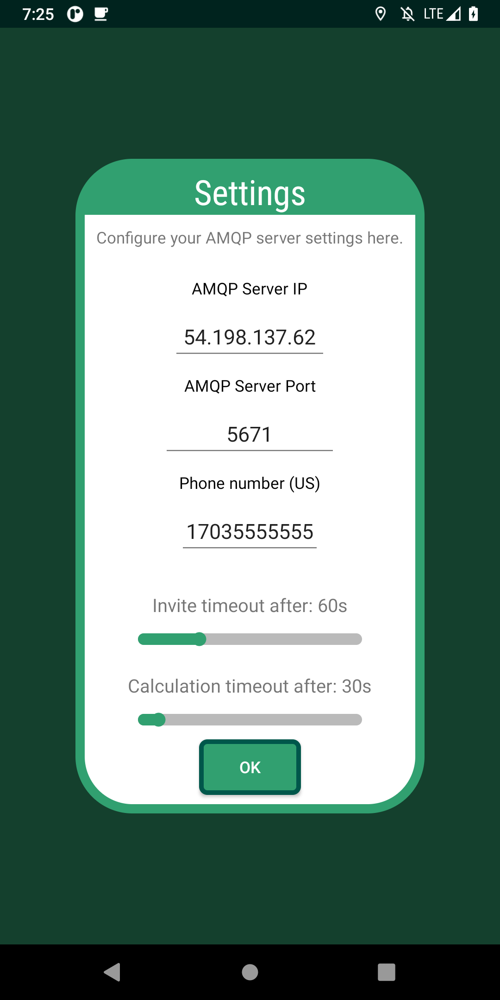 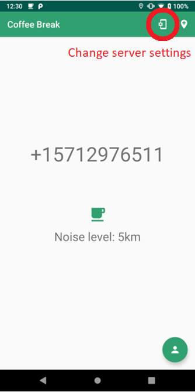

 * **AMQP Server IP:** The IP address or domain name of the RabbitMQ server to connect to. If more than one RabbitMQ server is utilized, each phone may connect to a different server as long as they are all running clustered together.
 * **AMQP Server Port:** By default, utilizing the server setup scripts, this should be 5671 (RabbitMq TLS).
 * **Phone number:** This should be automatically filled to your device’s phone number. With some SIM cards, it may not auto-populate, and a number may be entered manually. This is used as a UUID to facilitate communication and ensure the right data is going to the correct party.

## Location Settings:

Pressing the location pin icon in the top right will open a map view where you can view your current location and adjust the amount of noise that will be added to your location when you perform meeting calculations.

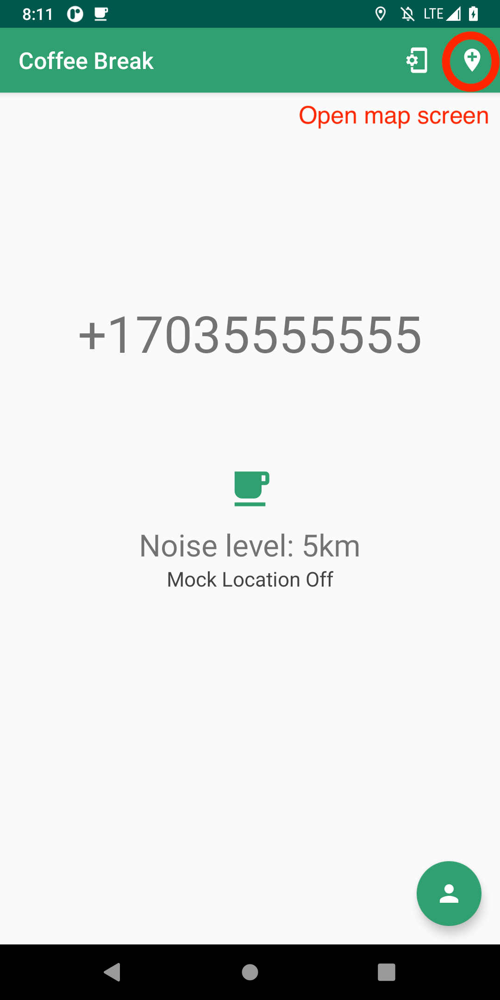 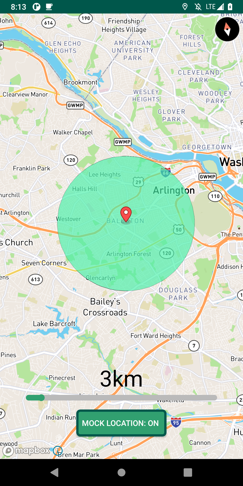

 * **Adjust noise:** You can use the slider to adjust your desired noise-level. This is represented visually by the green circle drawn around your current or mock location
 * **Mock Location:** By default, the app will use the device’s real location for meeting calculations. If you want to use an alternate location, you can press the `Mock Location` button to enable mock location mode. Then, you can press and hold on the map to specify a mock location to use instead of your real location. This feature was added for development purposes and allows for testing two devices in the same physical location, but this mode should be removed for any production capability.

 
## Initiating a meeting request

Before sending a request, you should make sure that the phone number of the person you want to meet with is saved to your phone’s contacts. (Through the normal Android Contacts app)

To send a meeting request, press the contact icon in the bottom right. This will open a screen that displays all the contacts on the device. To send a request, select the desired contact from the list.

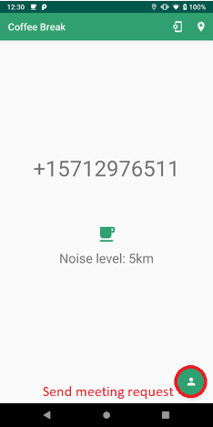 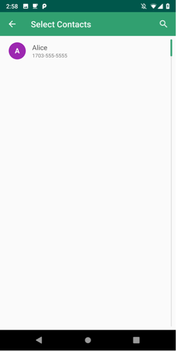

If the receiver accepts your meeting, the main app screen will change to indicate that the computation is occurring. If they reject your meeting, you will see a popup message indicating that the request was rejected.

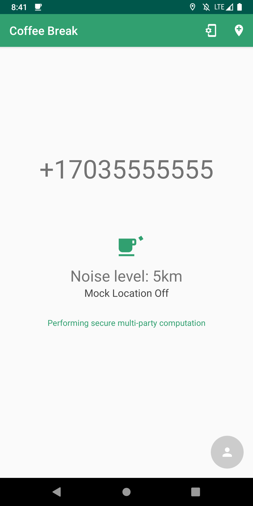 

## Receiving meeting requests

The Coffeebreak service is always running in the background of the device, so you can receive meeting requests even when the Coffeebreak app is closed. 

***Note: If the RabbitMQ server the receiver was previously connected to is down or has changed IP addresses, the receiver will not get a notification. At this point you need to ensure server(s) are up and point both phones to the server(s)***

When you receive a meeting request, you will receive a notification from Coffeebreak. Pressing this notification will open a screen where you have the option to accept or deny the request

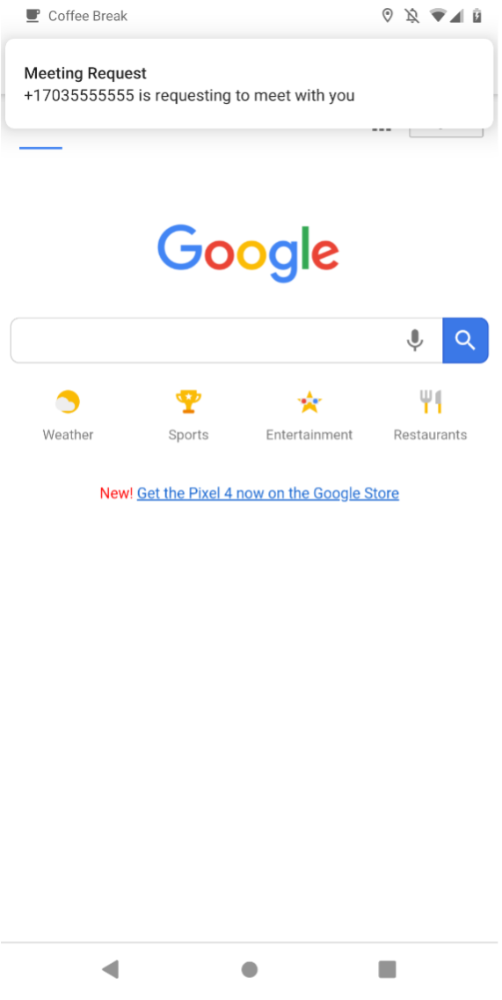 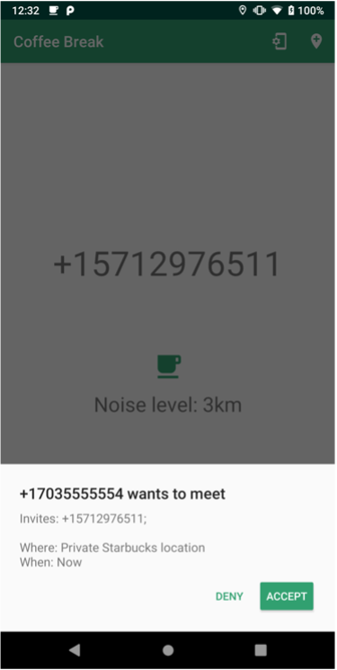

If you accept the meeting, you will see the main screen change to indicate that the computation is occurring.

## Output of meeting point computation

The time the computation takes to complete ranges from  ~15 seconds to several minutes, depending on the number of parties meeting and the latency of the communications between phones. When the computation finishes, you will receive a message displaying the meeting location. If you press the `Show on map` button, you will get a map view of the meeting point.

**Note:** Once you exit this screen by pressing the back button (or if you kill the app), you will no longer be able to view the output of the computation

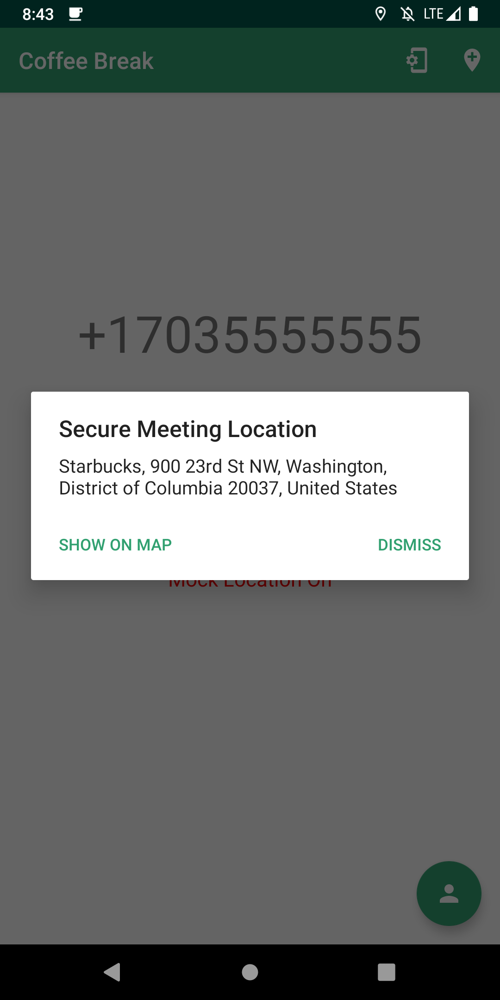 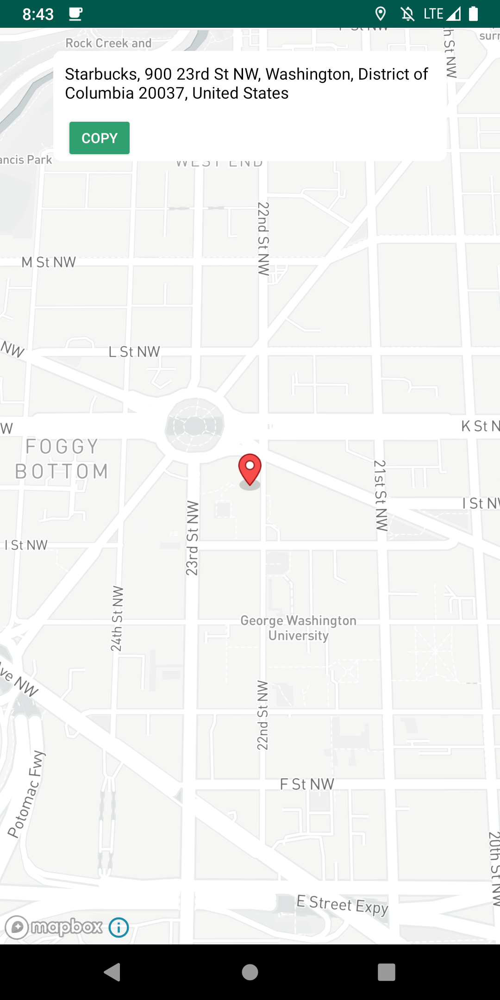

## Configure RabbitMQ server settings

As mentioned earlier, Coffeebreak requires one or more TLS configured RabbitMQ servers that are reachable via the phones.  To help ease experimentation we have provided scripts to help spin up RabbitMQ EC2 instances.

These scripts have been provided inside the `scripts` directory along with a [README.md](scripts/README.md) file. The `README.md` provides instructions for what is required to spin up RabbitMQ servers on AWS. The scripts are Ansible and Cloudformation based.

## Distribution Statement
Distribution Statement "A" (Approved for Public Release, Distribution Unlimited).
